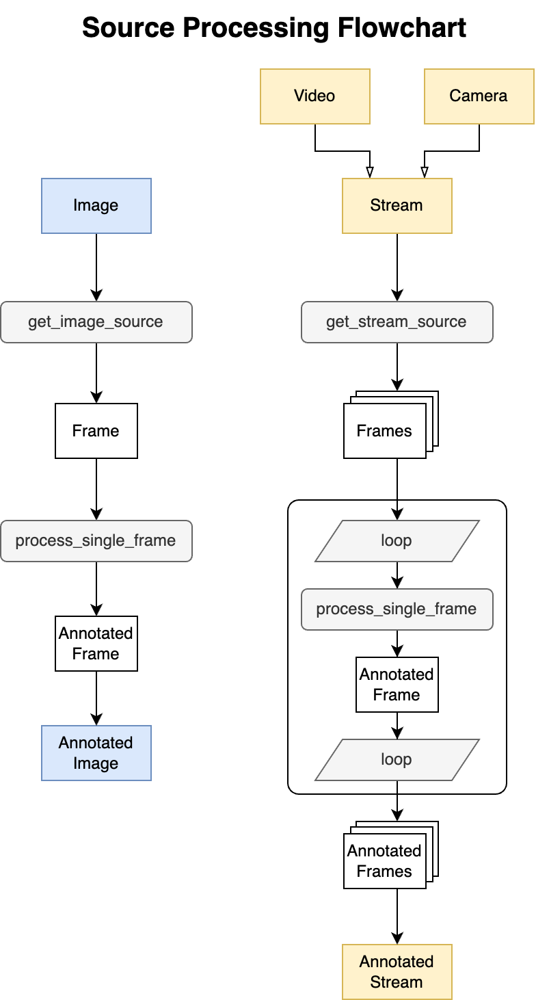

# Hand Gesture Detection Demo using Mediapipe

## Setup the demo

1. Run `python -m venv hand_venv`
2. Run `source hand_venv/bin/activate` if you use mac. Run `hand_venv/Scripts/activate` if you use windows.
3. Run `pip install -r requirements.txt` to install openCV and mediapipe.

## Run the demo
### Video Mode
Run `python main.py video data/source/<file_name>.mp4 data/landmarks/<output_file_name>.txt`. 

### Camera Mode
Run `python main.py camrea`. Remember to allow this program to access your camera.

### Image Mode
Work in progress.

## Project Structures
### `source_capture/`
Capture the sources for detection. You can use an image or a stream. A stream is either a video or a real-time camera capture.

### `source_process/`
Given the captured source, process the source. With the mediapipe hand detection model, retrieve the data points and draw them on the canvas.

## Source Processing Flowchart
### Definitons
#### Frame
A frame is a 2D array of pixels. A pixel is a 3-tuple of RGB/BGR values.
Therefore a frame is a 3D array.

#### Image
An image is a data structure that contains only one frame.

#### Stream
Both a video and a camera capture belongs to a stream.
A stream is a data structure that contains multiple frames.

### Process
No matter for Image or Stream, a frame is always processed by `process_single_frame`, a function
dedicated to use the mediapipe model to annotate the image.
